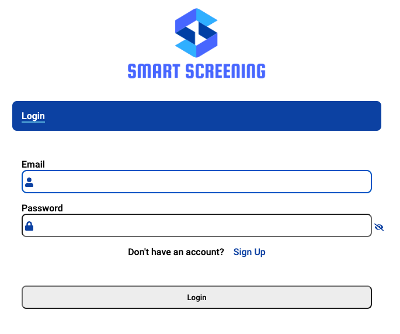
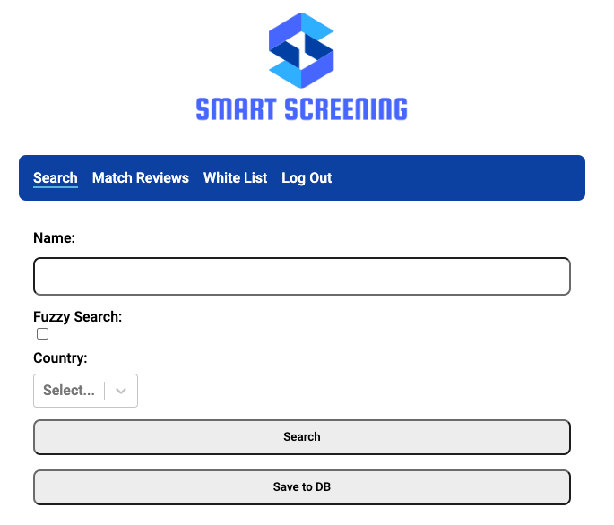
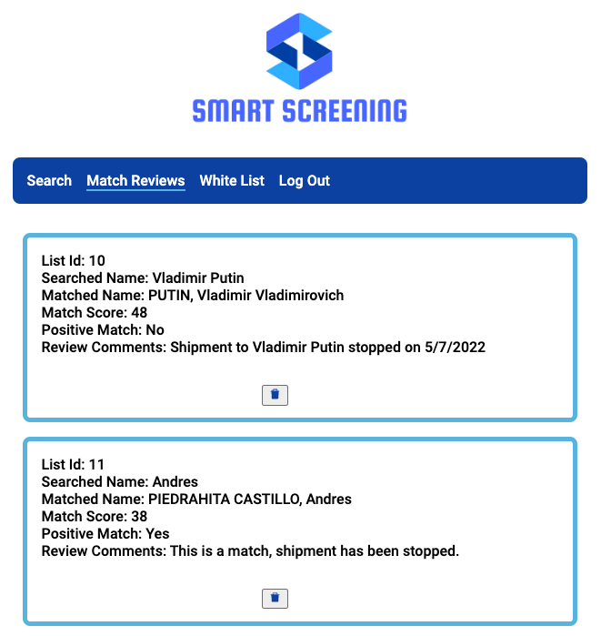
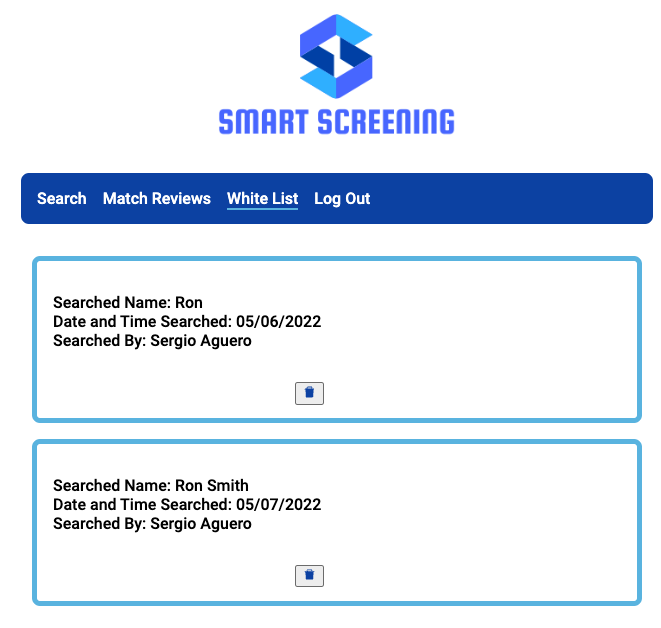

# Smart Screening App

This app consumes the consolidated screening list which is maintained by the [ITA] (https://www.trade.gov/consolidated-screening-list).

## Deployed version of the app

You can see the deployed version of the app [here] (https://screening-front.vercel.app/login)

### Libraries and Frameworks Used

This app was developed using Express JS in the backend with PG-Promise to connect to the database. The database is a Postgresql database deployed in Heroku. Users are authenticated using Firebase authentication.

### Use Case

This app helps exporters screen entities and save those searches in "Match Reviews". Users can also add searches to White List when the searched name does not return any results.
In short, this app helps fulfill due diligence requirements when exporting or conducting business with outside of the US.

### Screenshots

#### Login

#### Search

#### Match Reviews

#### White List

